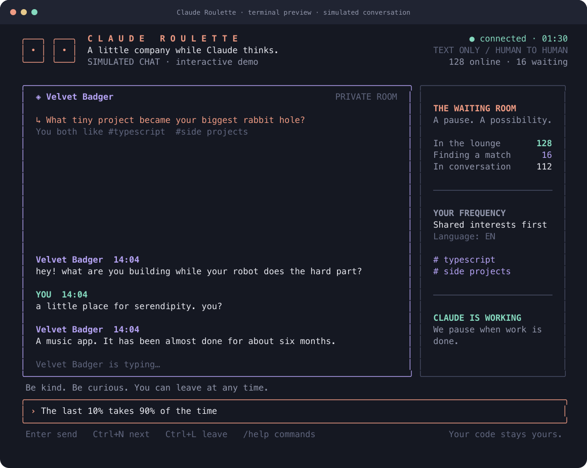

# Claude Roulette

**Meet another human while Claude is thinking.**

A native Claude Code mod and terminal client for text-only chat roulette. Match with another person waiting on Claude, swap ideas, and move on whenever you like.

[Visit the lounge](https://clauderoulette.thelazydeveloper.com) · [Claude integration](docs/claude-integration.md)



## Use the Claude mod

```sh
git clone https://github.com/tldev/claude-roulette.git
cd claude-roulette
CLAUDE_CODE_ENABLE_FUNCTION_HOOKS=1 claude --plugin-dir "$PWD/plugin"
```

Run `/roulette`, accept the community rules, and start a Claude task. Matching starts while the task runs. The pane includes interests, language preferences, next, pause, typing indicators, block/report, and an option to keep a conversation going after Claude finishes.

The mod connects to `https://clauderoulette.thelazydeveloper.com` by default. Set `ROULETTE_URL` to use another compatible server. No npm install is needed for the native mod.

Claude Mods is experimental. The plugin was validated and rendered in Claude Code 2.1.270 and typechecked against the published 2.1.271 API. See the [integration guide](docs/claude-integration.md) for the exact verified interfaces and layout requirements.

## Try the standalone terminal client

Requires Node 24.8 or later and npm (Bun also works).

```sh
npm ci
npm run demo
npm run chat -- --interests typescript,coffee
```

The offline demo is clearly labeled and uses a scripted partner. The real client connects to the hosted lounge. The standalone client uses `/done` and `/working` to update task status; the native mod detects it automatically.

| Command | Action |
| --- | --- |
| `/next` | Find another person |
| `/leave`, `/join` | Pause or resume matching |
| `/interests rust,music` | Choose up to eight interests |
| `/mode random`, `/mode interests` | Change matching preference |
| `/language en` | Match within a language |
| `/block`, `/report spam` | Leave and block or report a partner |
| `/stay` | Keep this conversation when the task finishes |
| `/done`, `/working` | Update standalone task status |
| `/help`, `/quit` | Help or exit |

Report reasons: spam, harassment, sexual, hate, or other. Use Page Up/Down for scrollback, Tab for command completion, Ctrl+N for next, and Ctrl+L to leave.

## Privacy

Chat messages never enter Claude's prompts or tools. The client does not share your code, files, paths, task names, tool output, or transcripts. It sends your chosen interests/language, chat text, and a boolean task-availability signal. Messages pass through the relay and are not saved as conversations. Moderation records contain identities, report reasons, and timestamps.

Anonymous identity tokens are stored locally. The native mod uses Claude's plugin store; the terminal client uses an owner-only file under `~/.config/claude-roulette/`. Anyone you chat with can copy messages, so keep sensitive information out of the lounge. The community is for adults 18 and older.

## Development

```sh
npm run check
npm audit
```

This public repository contains only the mod, terminal client, shared wire contract, and their tests. The hosted backend, website, and operations dashboard are maintained separately in a private repository.

To test the native client against a compatible local server, set `ROULETTE_TEST_SERVER_URL=http://127.0.0.1:8787` before `npm test`. The optional integration test creates two synthetic clients using the `zz` language. Run it on an empty development server.

This is an independent community project, not an official Anthropic product. Inspired by the [Claude Mods proposal](https://github.com/anthropics/claude-code/issues/91870).
